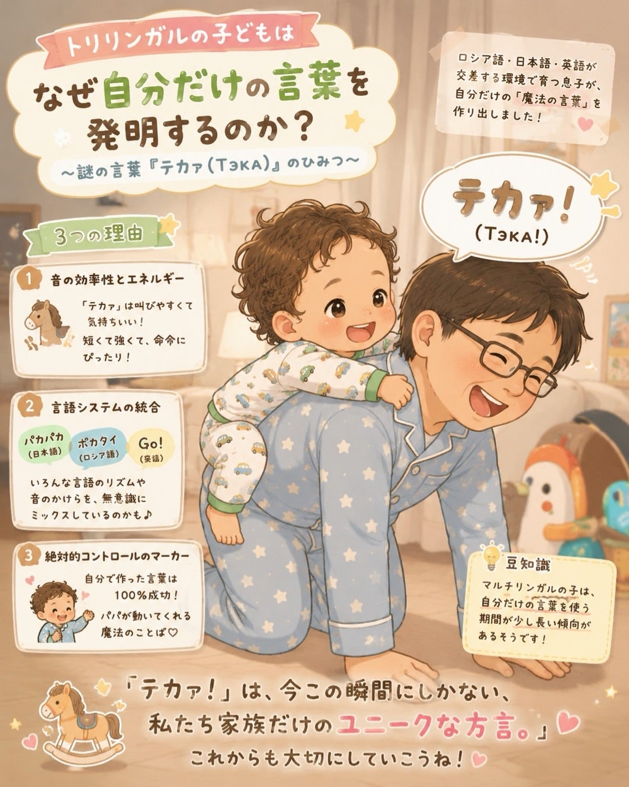

# 謎の言葉「テカ（Тэка）」：トリリンガルの子どもはいかにして独自の言語を発明するのか

バイリンガルやマルチリンガルの子育てをしていると、親が一生懸命に構築した言語システムに、遅かれ早かれ「カオス」が入り込んでくることに気づく瞬間があります。正確に言えば、大人にはカオスに見えるだけなのですが。

最近、我が家に新しい習慣ができました。息子がパパに背中でお馬さんごっこをしてほしい時、パパの背中に乗って、最後の音節にアクセントを置いて「テカァ！（ТэкА）」と力強く、まるで司令官のように号令をかけるのです。

面白いのは、私たちが意図的に全く違う言葉を教えようとしていたことです。スタートの合図として、万能な英語の «Go!» や日本語の «出発！» を用意していました。しかし、ロシア語、日本語、英語が交差する環境で育つ彼の脳は、この言語的な課題を独自の方法で解決したのです。

用意されたメニューから既存の単語を選ぶ代わりに、なぜトリリンガルの子どもは自分だけの言葉を発明するのでしょうか？この微笑ましい現象について、少し分析してみました。

## 「子どもエスペラント」という現象

神経生物学や言語学の観点から見ると、多言語環境にいる子どもの脳は膨大な作業を行っています。単に単語を覚えるだけでなく、音声、イントネーション、文法の3つの全く異なるシステムを分析しているのです。

子どもが自分自身の言葉を作り出すとき（言語学ではこれを自律語や発達的新造語と呼ぶことがあります）、それは混乱のサインではありません。逆に、子どもが言語の主導権を握っている証拠なのです。

私たちの「テカァ」を分析的な視点から紐解くと、このような言葉が生まれる主な理由を3つ挙げることができます。

## 1. 音韻的な効率性とエネルギー

子どもたちはもともと非常に実用的です。彼らは「今すぐ」機能する言葉を必要としています。[t]と[k]の音は破裂音で、発音しやすく、叫ぶと気持ちが良いものです。そして最後に開いた母音の「ア」にアクセントを置くことで、命令として完璧なリズムが生まれます。「Go」は響きが優しすぎ、「出発」は複雑な調音を必要とします。一方「テカァ」は鞭を打つように鋭く、専属のお馬さん（パパ）を操るのに最適なのです。

## 2. 言語システムの統合（シンセシス）

3カ国語の環境で育つ子どもは、常に異なるイントネーションのパターンを聞いています。日本語は非常にリズミカルで、単純な音節の繰り返しで構成されるオノマトペ（擬音語・擬態語）がたくさんあります（例：「パカパカ」など）。もしかすると「テカァ」は、日本語のリズムと他の言語の単語の断片（例えば、ロシア語の「ポカタイ（乗せて）」や日本語の「タカイ」など）を無意識に組み合わせたものなのかもしれません。

## 3. 絶対的コントロールのマーカー

大人に与えられた言葉を使うとき、子どもは他人のルールに従って遊んでいます。しかし、自分だけの言葉を作ることで、彼らはクリエイターになるのです。「テカァ」は確実に機能します。パパが笑い、動き出し、魔法がかかります。自分の発明品が100%の確率で成功するのに、なぜ他人の «Go» や «出発» を使う必要があるのでしょうか？

**豆知識：** 言語学者によると、マルチリンガルの子どもはモノリンガルの子どもに比べて、「自分だけの」言葉を使う期間が少し長くなる傾向があるそうです。3つの言語が脳内でそれぞれの「棚」に整理されるのを待つ間、子どもたちはこういった万能な架け橋となる言葉を使うのです。

## おわりに

私たちはよく、「子どもの言葉の発達は順調だろうか」「言語をしっかり区別できているだろうか」「負担をかけすぎていないだろうか」と心配になります。しかし、この司令官のような「テカァ！」といった瞬間は、そんな親の不安を見事に吹き飛ばしてくれます。

言語は単に頭にダウンロードされた辞書ではないことを思い出させてくれます。それは生き生きとした柔軟なツールであり、子どもたちは驚くべき創造力でそれを操る方法を学んでいるのです。

私たちは今のところ、«Go» を強要するつもりはありません。「テカァ」にはもう少し我が家にいてもらいましょう。結局のところ、これは今この瞬間にしか存在しない、私たち家族だけのユニークな方言なのですから。

皆さんのお子さんにも、本物の言葉より効果抜群だった「魔法の言葉」はありましたか？ぜひコメント欄で教えてください！

#トリリンガル育児 #多言語育児 #バイリンガル育児 #言葉の発達 #子ども語 #言い間違い #育児ブログ #ハーフキッズ #国際結婚 #男の子ママ #2歳児 #パパと息子 #言語学 #海外子育て #お馬さんごっこ
